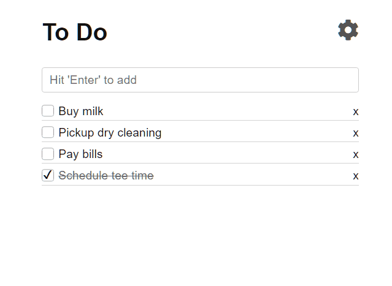

# June2018-ApiGateway

In this challenge we're going to learn how to setup an API Gateway, AWS Lambda function, and a datasource to presist data from an existing RESTful application.

<https://skittleson.github.io/ToDoApp/>

## Pre-requisites

The following tools and accounts are required to complete these instructions.

* [Complete Step 1 of the AWS Lambda Getting Started Guide](http://docs.aws.amazon.com/lambda/latest/dg/setup.html)
  * Setup an AWS account
  * [Setup the AWS CLI](https://docs.aws.amazon.com/lambda/latest/dg/setup-awscli.html)
* Both NodeJS and .NET Core 2+ is required
    * <https://nodejs.org/en/>
    * <https://www.microsoft.com/net/learn/get-started/windows>

## Level 0 - Setup
- Pick a data source (RDS MySql or DynamoDB).  Start an instance!  Allocating can take time.
    - RDS MySql helper scripts
    - DynamoDB

## Level 1 - Lambda function to choosen data source
- Create a lambda function that will create a to do item

## Level 2 - Configure the API Gateway
- Create an API Gateway
- Map api gateway resource to the new lambda function
- Configure the ToDo app. Hint: Use developer tools in Chrome to show the request/response in the network tab.
- CORS

## Level 3 - Delete & Update To Do Item
- Add support for deleting a to do list item and marking it complete. Hint: Create a new lambda functions per task.
- Map api gateway resource to each lambda function

## Level 4 - 
- Setup Static hosting
- api gateway security
-  Setup per user authentication for application.

## Boss
YTB
