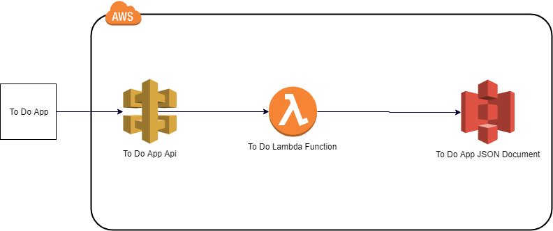

# June2018-ApiGateway

In this challenge we're going to learn how to setup an API Gateway, AWS Lambda function, and AWS S3 data source to persist data from an existing RESTful application.

<https://skittleson.github.io/ToDoApp/>


The architecture should look like this:


Example record

```json
{
  "id": 1,
  "note": "Buy milk",
  "completed": false
}
```

## Pre-requisites

The following tools and accounts are required to complete these instructions.

- [Complete Step 1 of the AWS Lambda Getting Started Guide](http://docs.aws.amazon.com/lambda/latest/dg/setup.html)
  - Setup an AWS account
  - [Setup the AWS CLI](https://docs.aws.amazon.com/lambda/latest/dg/setup-awscli.html)
- NodeJS or .NET Core 2+ is required
  - <https://nodejs.org/en/>
  - <https://www.microsoft.com/net/learn/get-started/windows>

## Level 0 - Setup S3 to Store To Do App Data

- Setup a S3 bucket as a data source.
- Upload the `to do` database from [src/todos.json](src/todos.json) into the S3 bucket.

[AWS Reference for S3 bucket creation](https://docs.aws.amazon.com/AmazonS3/latest/gsg/CreatingABucket.html)

## Level 1 - Starter Lambda Function

Create an AWS's Lambda function that will retrieve a list of To Do items in the S3 bucket previously created.

- Use either [C#](src/lambdasharp-june) or [NodeJs](src/nodejs/index.js) lambda function provided in this repo to start.
- Create an IAM role with S3 and CloudWatch permissions. Assign it to the lambda function.
  - Create a new Role in AWS IAM
  - Choose the service that will use this role: **Lambda** . Click **Next**
  - Select **AmazonS3FullAccess** and **CloudWatchLogsFullAccess** . Click **Next**.
  - Give it a name and apply to the lambda function created.
- Deploy the lambda function!

[NodeJS AWS SDK](https://aws.amazon.com/sdk-for-node-js/)

[C# AWS SDK](https://docs.aws.amazon.com/AmazonS3/latest/dev/UploadObjSingleOpNET.html)

## Level 2 - Create an API Gateway

- Create an API Gateway.
- Create a new resource `todo`.
- Create a new `GET` method in api gateway to the lambda function created from level 1. Be sure to use `Use Lambda Proxy integration`.
- Create a new `OPTIONS` method in api gateway to the lambda function created from level 1. Be sure to use `Use Lambda Proxy integration`.
- Deploy API and configure the To Do App. Upon saving, the app will attempt to connect for a list of items.
  

[AWS Reference for example of Lambda and API Gateway](https://docs.aws.amazon.com/apigateway/latest/developerguide/api-gateway-create-api-as-simple-proxy-for-lambda.html)

<details>
  <summary>Hints:</summary>

  Be sure to `Deploy` the Api! Action drop down, `Deploy Api` on every change.

  Chrome console will throw an error about origin if not set (also see level 1 javascript hint): `Access-Control-Allow-Origin`

  Check CloudWatch for Lambda log events.

</details>

[AWS doc information about API Gateway](https://docs.aws.amazon.com/apigateway/latest/developerguide/welcome.html)

## Level 3 - Create, Delete & Update a To Do Item

The To Do app also supports the following functions:

- On resource action method `POST`, create a to do item to data store. Return a single to do json as the api response.
- On resource action method `DELETE` resource, delete a to do item to data store. Return nothing from api response.
- On resource action method `PUT` resource, update a to do item. Return item from api response.

<details>
  <summary>Hints:</summary>

    Be sure to `Deploy` the Api! Action drop down, `Deploy Api` on every change.

    Check the network tab in chrome for the `To Do` app xhr requests!

    CORS issues? Did you add OPTIONS method that mapped to the lambda function?
    
    Check CloudWatch logs.

</details>

## Level 4 - Security

- Host the To Do app code on AWS's S3 service. The repo is located here: https://github.com/skittleson/ToDoApp
- Configure the Api to allow requests from ONLY that S3 static site using CORS.

[AWS docs about S3 static site hosting](https://docs.aws.amazon.com/AmazonS3/latest/dev/WebsiteHosting.html)

[AWS docs about CORS](https://docs.aws.amazon.com/apigateway/latest/developerguide/how-to-cors.html)

## Boss Challenge


- Secure the `To Do` app using the API Gateway's **API Key** and **Usage Plans**.  Add an API key in the settings of the `To Do` app.
- Remove all "Access-Control-Allow" headers in code and only use API Gateway for `OPTIONS` security.

[AWS Reference for api key setup](https://docs.aws.amazon.com/apigateway/latest/developerguide/api-gateway-setup-api-key-with-console.html)
